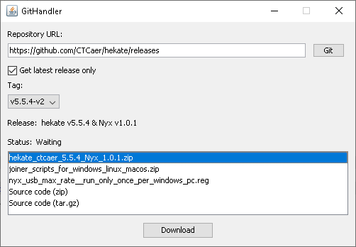

# GitHandler
A Java library for handling GitHub repositories

This project can either be used as a library for your Java projects or as a standalone application.

GitHandler was developed and tested on Windows, but there shouldn't be any reason why you can use this program on Mac/Linux.

## Standalone Application Features
- Sorting of assets by their associated tag.
- Downloading assets directly from the repository's releases.
- Option to grab latest release only

## Using GitHandler Standalone
- Launch the "GitHandler.jar" file
- Copy the URL of either the repository's main page or the repository's releases page.
- Paste the URL into the Repository URL box.
- (Optional) Select "Get latest release only".
- Click on the "Git" button.
- GitHandler will fetch the assets from the latest 10 releases so long as they haven't been archived.
- Select the tag you wish to download assets from.
- Select the asset you wish to download.
- Click on the "Download" button.
- Choose where to save the file.
- You're all done, the asset should be where you chose to save it.

## Using GitHandler as a Library
- Import the "GitHandler.jar" to your Java project
- Refer to the Javadoc or to this [source file](./src/ui/StandaloneUI.java) to learn how to use it.
